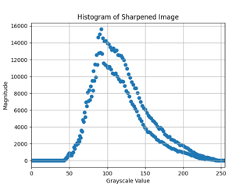
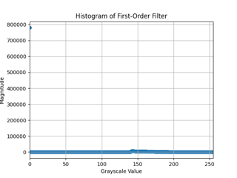

# Root segmentation

Within the era of climate changes and increase in global demographics, the demand for reliable
food sources, and agricultural products in particular, is a constant need.
The purpose of this project is to create a robust method for measuring major root trait, and by that
providing insights into plant health. Our objective is to develop an algorithm to accurately detect
and count root hairs and test the impact of super-resolution. The innovation lies in the idea to
remove the main root from the segmented image and thereby isolate the root hairs. We propose a
method which first performs image segmentation over the raw image to extract the root with its’
branches from the soil background, then uses morphological operators to remove the main root
without branches and finally detects and counts root hairs by mapping each root hair to a separate
contour. The goal is to achieve over 80% precision in detecting and counting root hairs, where
super-resolution images expected to outperform non-super-resolution images.

# Project goals

The project aims to develop a non-invasive method for assessing plant health and nutrient uptake
by leveraging agricultural root image segmentation. Our goal is to propose a solution that
determines the plant's condition in situ—whether it receives adequate nutrition, water, and other
vital factors—without uprooting it. This approach utilizes image segmentation and classic
algorithms, avoiding neural networks, to accurately separate the root structure from the soil
background. The focus is on detecting and counting root hairs, crucial indicators of root health and
nutrient absorption efficiency. This methodology seeks to enhance agricultural practices by
providing insights into plant health directly from field imagery, facilitating informed decisions for
optimal crop management. Our project aims to achieve a precision score exceeding 80% in the task
of detecting and counting root hairs. Additionally, we seek to determine if super-resolution images
consistently yield higher accuracy scores compared to non-super-resolution images on average.

# Approach, Design, and Solution 
To address the challenge of counting root hairs, our approach began by recognizing the importance of preprocessing the image effectively. Starting with segmentation yielded a clear representation of the root in white against a black background. Once we obtained this binary image and understood the root's structure, our next step focused on isolating the branching hairs from the main root. By identifying distinct contours within the segmented image, we aimed to accurately count the individual root hairs.

# Block Diagram 

# Proposed Algorithm:
### Original Image : 
|  |  |
|:-----------------------------------------------------------------------------------------------:|:-----------------------------------------------------------------------------------------------:|
| **Bell Pepper**                                                                                 | **Arabidopsis**                                                                                 |

                                                                             

## Step 1:
Convert the color image into grayscale and apply un-sharp filter to create sharpened image, which consists of subtracting the output of a Gaussian filter from the grayscale image:
sharpened=α ∙grayscale-β∙blured,where α=1.5,β=0.5
### Gray scale images : 
|  |  |
|:-----------------------------------------------------------------------------------------------:|:-----------------------------------------------------------------------------------------------:|
| **Bell Pepper**                                                                                 | **Arabidopsis**                                                                                 |

### Sharpened images : 
|  |  |
|:-----------------------------------------------------------------------------------------------:|:-----------------------------------------------------------------------------------------------:|
| **Bell Pepper**                                                                                 | **Arabidopsis**                                                                                 |

## Step 2 : 
Apply First-order filter to remove most portions of the background.
The assumption is that the largest group of pixels within the histogram is related to the background, and by the nature of the root, the pixel group related to it will be spread in the brighter grayscale range.
We set a threshold value that corresponds to 0.78% of the most common pixel value and has a higher grayscale value than the most common pixel value, assigning all other pixels to 0 (black). 

#### Bell Pepper Histogram:
|  |  |
|:-----------------------------------------------------------------------------------------------:|:-----------------------------------------------------------------------------------------------:|
| **Before First Order Filter**                                                                                 | **After First Order Filter**                                                                                 |

#### Arabidopsis Histogram:
|  |  |
|:-----------------------------------------------------------------------------------------------:|:-----------------------------------------------------------------------------------------------:|
| **Before First Order Filter**                                                                                 | **After First Order Filter**                                                                                 |

### First Order Filter Output:
|  |  |
|:-----------------------------------------------------------------------------------------------:|:-----------------------------------------------------------------------------------------------:|
| **Bell Pepper**                                                                                 | **Arabidopsis**                                                                                 |

## Step 3 (Bell Pepper only) : 
Dividing the image into clusters by apply Mean-Shift filter to find clusters within the image.
#### Mean Shift Filter:

## step 4 : 
Apply thresholding using Otsu algorithm, and find the largest cluster, which we assume related to the root.
### Figure for demonstration:

## step 5 : 
Apply Morphological Opening operator on the image to remove outer noise not related to the root and Closing operator to fill gaps within the root.
### Figure for demonstration:

## step 6 : 
Apply fine-tuning to remove outer noise by finding again the largest cluster.
This is the final step to get a segmented image.
### Figure for demonstration:

## step 7 : 
Filter the root only from the segmented image by applying several iterations of Morphological Opening operator to remove most of the root-hairs and then applying several iterations of Closing operator for complementary corrections.
### Figure for demonstration:

## step 8 : 
Filter the root-hairs only from the segmented image by subtracting the root only from the segmented image. 
### Figure for demonstration:

### step 9 :
Count the number of root-hairs by detecting the number of contours.

### Figure for demonstration:

Calculate the root’s length, by calculating the Euclidian distance between the leftmost and rightmost pixels, assuming that the root is relatively linear shaped.

Calculate the root-hair density by dividing the number of root-hairs by the root’s length.

## Note : 
We should have a second thought of applying Mean-Shift filter at step #3. The result of applying thresholding (step #4) right after first-order filter (step #2) may be better.

# ARBIDIOPSIS Root Algorithm : 

This algorithm based on the same principles of the Bell-Pepper algorithm but there are several changes : 

## step 2 : 
we defined cutoff value to be the first value that gets 35% (inspired by -3db) of the greatest quantity, which related to the background, and has brighter gray value, and set all pixels with lower gray value to 0 (black).

### Figures for demonstration:
Histogram:     
 

Then we skip on applying Mean-Shift filter and moved directly to Otsu algorithm. 

## The results : 
### The Original Image : 

### Final Bitwise fine-tuning Image : 

### Hairs detection : 
Finding the haris happens in the same way:

### Root Only :

### Hairs Only : 

